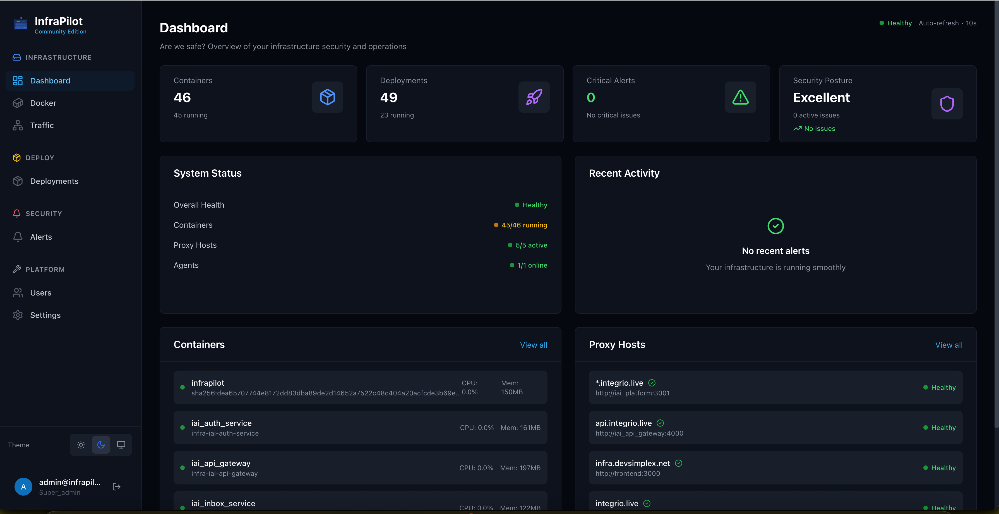

<p align="center">
  
</p>

<h1 align="center">InfraPilot Community Edition</h1>

<p align="center">
  <a href="LICENSE"></a>
  <a href="https://go.dev/"></a>
  <a href="https://nextjs.org/"></a>
  <a href="https://github.com/infrapilothq/InfraPilot/releases"></a>
</p>

<p align="center">
  <strong>Docker-native infrastructure control plane</strong> — manage traffic, containers, logs, and alerts without touching the host OS.
</p>

<p align="center">
  
</p>


## What is InfraPilot CE?

InfraPilot CE is a self-hosted control plane for small teams running Dockerized workloads on a single Linux server. It combines Nginx proxy management, Docker operations, log analytics, and alerting into one dashboard — no Kubernetes, no cloud agent, no SSH required.

### Who it's for

- SaaS founders running multiple Dockerized services on one server
- DevOps teams who want visibility without SSH access
- Agencies managing client apps on shared infrastructure
- Engineers who want Nginx + Docker + observability in one place

### What it is NOT

- Not a hosting control panel (cPanel, Plesk)
- Not a Kubernetes replacement
- Not a VM manager


## Features

### Reverse Proxy & SSL
- Visual Nginx configuration with live preview
- Automatic SSL certificates via Let's Encrypt
- Security headers (HSTS, CSP, X-Frame-Options)
- Rate limiting and IP allowlists/denylists
- Basic authentication per proxy host
- Dynamic Docker network attachment

### Container & Stack Management
- Container list with real-time status
- Start, stop, restart, and delete containers
- Live log streaming and web-based terminal (exec)
- Docker Compose stack deployment wizard
- Image pull, volume and network management

### Traffic Analytics
- Nginx access log ingestion via TimescaleDB
- Real-time request rate, error rate, and status-code breakdown
- Top paths, status code distribution, client IPs
- Per-domain filtering, 24-hour rolling window

### Alerting
- Channels: SMTP, Slack, webhooks
- Rules: container crash, SSL expiry, high error rate
- Alert history

### Security & Access
- Role-based access control (RBAC)
- Multi-factor authentication (TOTP)
- JWT with refresh tokens

### Deployments
- Docker image deployments with rollback
- Redeploy with latest image
- Webhook triggers for CD pipelines


## CE vs Enterprise Edition

| Feature | CE | EE |
|---------|:--:|:--:|
| Reverse proxy + SSL | ✅ | ✅ |
| Container & stack management | ✅ | ✅ |
| CD webhooks + one-step rollback | ✅ | ✅ |
| Traffic analytics — real-time, 24h | ✅ | ✅ |
| Alerting (SMTP / Slack / webhook) | ✅ | ✅ |
| RBAC + MFA (TOTP) | ✅ | ✅ |
| Log persistence | ✅ | ✅ |
| Traffic analytics — 7-day+, geo, CSV | ❌ | ✅ |
| Full deployment pipelines (multi-env, canary) | ❌ | ✅ |
| Deployment audit logs | ❌ | ✅ |
| Secrets management (AES-256-GCM) | ❌ | ✅ |
| SSO / OIDC / SAML | ❌ | ✅ |
| CVE scanning (Trivy) + SBOM | ❌ | ✅ |
| Compliance reporting & policy engine | ❌ | ✅ |
| Rust agent (mTLS enrollment) | ❌ | ✅ |
| Priority support | ❌ | ✅ |

> CE is AGPL-3.0 licensed and free forever. EE requires a license key — contact **sales@infrapilot.org**.


## CE Limitations

Be aware of these constraints before deploying CE in production:

**Single server only**
CE manages one Docker host via one agent. There is no multi-node or multi-agent support — each InfraPilot CE instance controls the server it is deployed on.

**No SSO**
Authentication is username + password with optional TOTP. OIDC, SAML, and LDAP/AD integration are EE-only.

**No image scanning before deploy**
CE deploys images directly without vulnerability scanning. You are responsible for vetting images before deployment.

**No audit log**
User actions (logins, proxy changes, deployments) are not recorded to a persistent audit trail in CE.

**No private registry auth**
Image pulls are unauthenticated. To pull from a private registry, configure Docker daemon credentials directly on the host — CE cannot manage registry credentials.

**No policy gates**
Deployments are not checked against policies. There is no way to block a deploy based on image age, CVE score, or custom rules.

**Single organization**
CE is designed for a single team/organization. There is no multi-tenancy.


## How InfraPilot CE compares

| Feature | InfraPilot CE | Nginx Proxy Manager | Portainer |
|---------|:---:|:---:|:---:|
| Reverse proxy | ✅ | ✅ | ❌ |
| SSL automation | ✅ | ✅ | ❌ |
| Container management | ✅ | ❌ | ✅ |
| Container exec / terminal | ✅ | ❌ | ✅ |
| Log analytics | ✅ | ❌ | ❌ |
| Alerting | ✅ | ❌ | ❌ |
| CD webhooks | ✅ | ❌ | ❌ |
| RBAC + MFA | ✅ | ❌ | ✅ (paid) |
| Open source | ✅ | ✅ | ✅ (CE) |


## Quick Start

### Requirements

- Linux x86_64 or ARM64
- Docker 24+ and Docker Compose V2
- 2 CPU cores, 2 GB RAM minimum

### Option A — All-in-one (easiest)

A single container that embeds PostgreSQL, Redis, and the InfraPilot agent:

```bash
git clone https://github.com/infrapilothq/InfraPilot.git
cd InfraPilot

# Set your JWT secret (required)
export JWT_SECRET=$(openssl rand -base64 32)

docker compose up -d
```

Then open **http://localhost** — you'll be prompted to create your admin account on first visit.

> **Your first account gets full admin access.** No default credentials are used.

### Option B — Production multi-container

Separate PostgreSQL, Redis, Nginx, Backend, Frontend, and Agent containers for easier upgrades and scaling:

```bash
git clone https://github.com/infrapilothq/InfraPilot.git
cd InfraPilot

# Copy and configure environment
cp .env.example .env
# Edit .env: set JWT_SECRET, POSTGRES_PASSWORD, REDIS_PASSWORD

docker compose -f docker-compose.prod.yml up -d
```

### Environment Variables

| Variable | Required | Description |
|----------|:--------:|-------------|
| `JWT_SECRET` | ✅ | Secret for signing JWT tokens — generate with `openssl rand -base64 32` |
| `DATABASE_URL` | | PostgreSQL connection string (embedded if not set) |
| `REDIS_URL` | | Redis connection string (embedded if not set) |
| `POSTGRES_PASSWORD` | ✅ (prod) | PostgreSQL password |
| `REDIS_PASSWORD` | ✅ (prod) | Redis password |
| `HTTP_PORT` | | HTTP port (default: `80`) |
| `HTTPS_PORT` | | HTTPS port (default: `443`) |
| `LETSENCRYPT_EMAIL` | | Email for Let's Encrypt SSL certificates |
| `LETSENCRYPT_STAGING` | | Use Let's Encrypt staging CA (default: `true`) — set to `false` for production |
| `ALLOWED_ORIGINS` | | CORS origins (default: `http://localhost,https://localhost`) |
| `DATA_DIR` | | Host path for persistent data (default: `./data`) |

See [docs/CONFIGURATION.md](docs/CONFIGURATION.md) for the complete reference.

### SSL Configuration

Set `LETSENCRYPT_EMAIL` and point your domain's DNS A record at the server. Certificates are issued and renewed automatically when you add a proxy host in the dashboard. Set `LETSENCRYPT_STAGING=false` once you're ready for production.


## Architecture

```
Browser
  │
  ▼
Nginx (port 80/443)
  │ proxy_pass /api  ──────────────────────┐
  │ proxy_pass /     ─────────┐            │
  │                           │            │
  ▼                           ▼            ▼
Frontend (Next.js)        Backend (Go API — :8080)
                               │
                               │ gRPC (:9090)
                               ▼
                          Agent (Go)
                            │     │
                            ▼     ▼
                         Docker  Nginx
                         Daemon  Config
                            │
                            ▼
                    Your containers
```

The **Agent** runs as a container, communicates with the Backend via gRPC, and is the only component that touches the Docker socket and Nginx config files. The Backend and Frontend never need host access.


## Development

```bash
git clone https://github.com/infrapilothq/InfraPilot.git
cd InfraPilot

docker compose -f docker-compose.dev.yml up --build
```

Services start with hot reload: backend and agent use [Air](https://github.com/air-verse/air), frontend uses the Next.js dev server.

See [docs/DEVELOPMENT.md](docs/DEVELOPMENT.md) for full details.


## Documentation

- [Development Guide](docs/DEVELOPMENT.md)
- [Configuration Reference](docs/CONFIGURATION.md)
- [Proxy Management](docs/PROXY.md)
- [Traffic Analytics](docs/ANALYTICS.md)
- [Docker Compose Stacks](docs/STACKS.md)
- [Alerting](docs/ALERTS.md)


## Contributing

Contributions welcome. Please open an issue before large changes to discuss direction. See [CONTRIBUTING.md](CONTRIBUTING.md) for the full guide.


## Security

Report vulnerabilities to **security@infrapilot.org** — do not open public issues.


## License

AGPL-3.0 — see [LICENSE](LICENSE)

---

<p align="center">InfraPilot CE is maintained by <a href="https://infrapilot.org">Team InfraPilot</a></p>
